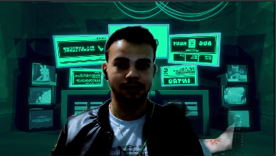

<h2 id="the_challenge"  align="center">⚡ Spacetraveling </h2>

   
 Creating a project from scratch by <b>Rockeseat</b>. Challenge to create a blog using nextjs, following the figma layout, and with integration to a HeadlessCMS to populate this blog, processing this data (formatting, etc.), parameterizing the routes, and adding features such as: text reading time, among others... In addition, 
</b>

 
 

<h5 id = "author" align="center"></h5>

<table align="center">
  <tr>
      <td>
      <a href="https://github.com/gabriel-durr">
         
      </a>
      </td>
  </tr>
</table>

        <b><em>Made with 💜&ensp; by Gabriel Dürr </em></b>

